# Blender2.8からMMDにもっていく方法

**素人**が始めたばかりの友人向けに説明したものをブラッシュアップしたものです．

用語とかおかしいところも多々あると思いますが感じ取ってください．

<!-- TOC -->

- [Blender2.8からMMDにもっていく方法](#blender28%e3%81%8b%e3%82%89mmd%e3%81%ab%e3%82%82%e3%81%a3%e3%81%a6%e3%81%84%e3%81%8f%e6%96%b9%e6%b3%95)
   - [環境](#%e7%92%b0%e5%a2%83)
   - [ソフトの用意](#%e3%82%bd%e3%83%95%e3%83%88%e3%81%ae%e7%94%a8%e6%84%8f)
   - [モデルを用意します](#%e3%83%a2%e3%83%87%e3%83%ab%e3%82%92%e7%94%a8%e6%84%8f%e3%81%97%e3%81%be%e3%81%99)
   - [blenderでの設定](#blender%e3%81%a7%e3%81%ae%e8%a8%ad%e5%ae%9a)
      - [アーマチュアの作成](#%e3%82%a2%e3%83%bc%e3%83%9e%e3%83%81%e3%83%a5%e3%82%a2%e3%81%ae%e4%bd%9c%e6%88%90)
      - [ペアレント設定](#%e3%83%9a%e3%82%a2%e3%83%ac%e3%83%b3%e3%83%88%e8%a8%ad%e5%ae%9a)
         - [オブジェクトとアーマチュアのペアレント](#%e3%82%aa%e3%83%96%e3%82%b8%e3%82%a7%e3%82%af%e3%83%88%e3%81%a8%e3%82%a2%e3%83%bc%e3%83%9e%e3%83%81%e3%83%a5%e3%82%a2%e3%81%ae%e3%83%9a%e3%82%a2%e3%83%ac%e3%83%b3%e3%83%88)
         - [頂点グループの設定](#%e9%a0%82%e7%82%b9%e3%82%b0%e3%83%ab%e3%83%bc%e3%83%97%e3%81%ae%e8%a8%ad%e5%ae%9a)
         - [アーマチュア(モディファイアー)を追加](#%e3%82%a2%e3%83%bc%e3%83%9e%e3%83%81%e3%83%a5%e3%82%a2%e3%83%a2%e3%83%87%e3%82%a3%e3%83%95%e3%82%a1%e3%82%a4%e3%82%a2%e3%83%bc%e3%82%92%e8%bf%bd%e5%8a%a0)
         - [ボーン名の変更](#%e3%83%9c%e3%83%bc%e3%83%b3%e5%90%8d%e3%81%ae%e5%a4%89%e6%9b%b4)
         - [追従させるオブジェクトの追加](#%e8%bf%bd%e5%be%93%e3%81%95%e3%81%9b%e3%82%8b%e3%82%aa%e3%83%96%e3%82%b8%e3%82%a7%e3%82%af%e3%83%88%e3%81%ae%e8%bf%bd%e5%8a%a0)
            - [同じボーンに追従させる場合](#%e5%90%8c%e3%81%98%e3%83%9c%e3%83%bc%e3%83%b3%e3%81%ab%e8%bf%bd%e5%be%93%e3%81%95%e3%81%9b%e3%82%8b%e5%a0%b4%e5%90%88)
            - [新たにボーンを追加する場合](#%e6%96%b0%e3%81%9f%e3%81%ab%e3%83%9c%e3%83%bc%e3%83%b3%e3%82%92%e8%bf%bd%e5%8a%a0%e3%81%99%e3%82%8b%e5%a0%b4%e5%90%88)
      - [テクスチャ等の設定](#%e3%83%86%e3%82%af%e3%82%b9%e3%83%81%e3%83%a3%e7%ad%89%e3%81%ae%e8%a8%ad%e5%ae%9a)
         - [ノードの設定](#%e3%83%8e%e3%83%bc%e3%83%89%e3%81%ae%e8%a8%ad%e5%ae%9a)
         - [テクスチャの出力](#%e3%83%86%e3%82%af%e3%82%b9%e3%83%81%e3%83%a3%e3%81%ae%e5%87%ba%e5%8a%9b)
         - [ボーンの修正](#%e3%83%9c%e3%83%bc%e3%83%b3%e3%81%ae%e4%bf%ae%e6%ad%a3)
      - [エクスポート](#%e3%82%a8%e3%82%af%e3%82%b9%e3%83%9d%e3%83%bc%e3%83%88)
   - [PMXEでの調整](#pmxe%e3%81%a7%e3%81%ae%e8%aa%bf%e6%95%b4)
      - [サイズの調整](#%e3%82%b5%e3%82%a4%e3%82%ba%e3%81%ae%e8%aa%bf%e6%95%b4)
      - [テクスチャの調整](#%e3%83%86%e3%82%af%e3%82%b9%e3%83%81%e3%83%a3%e3%81%ae%e8%aa%bf%e6%95%b4)
   - [完成！！！！！](#%e5%ae%8c%e6%88%90)

<!-- /TOC -->

## 環境

| 使用ソフト | バージョン等 |
| :--------: | :----------: |
|     OS     |  Windows10   |
|  blender   |    2.81a     |
| mmd_tools  |    0.7.0     |
| PmxEditor  | 0.2.5.4(x64) |

## ソフトの用意
必須blenderのアドオン : [mmd_tools](https://github.com/sugiany/blender_mmd_tools "github.com/sugiany/blender_mmd_tools") はこちらからどうぞ

## モデルを用意します
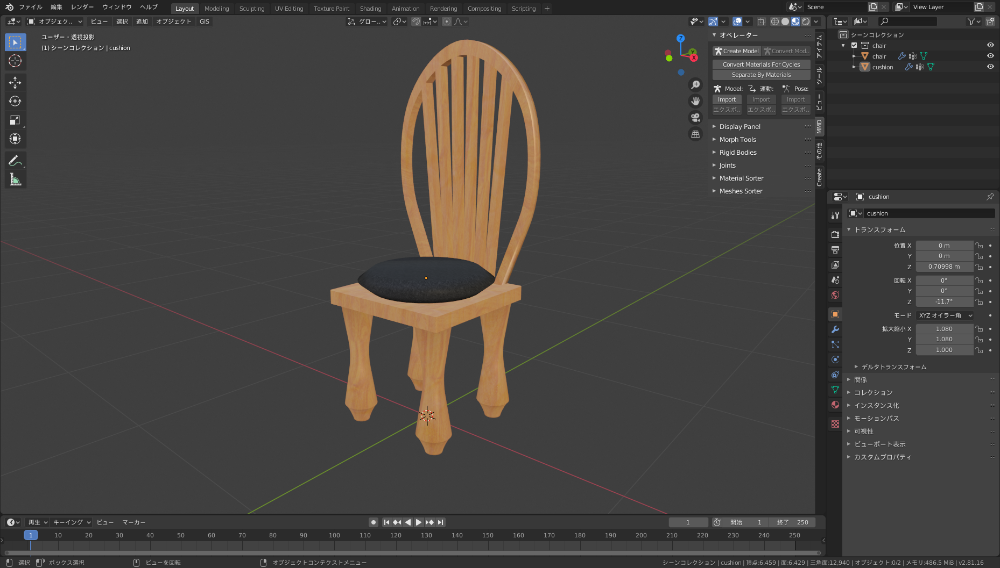
ここでは作り方とかUV展開とかの解説はしません.
二つのオブジェクト，それぞれが別のマテリアルを有したモデルで解説します．

## blenderでの設定

### アーマチュアの作成

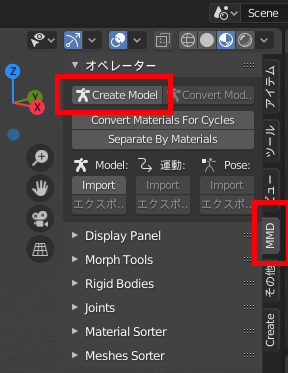

MMDタブから'Create Model'ボタンを押して基準となるアーマチュアを作ります．

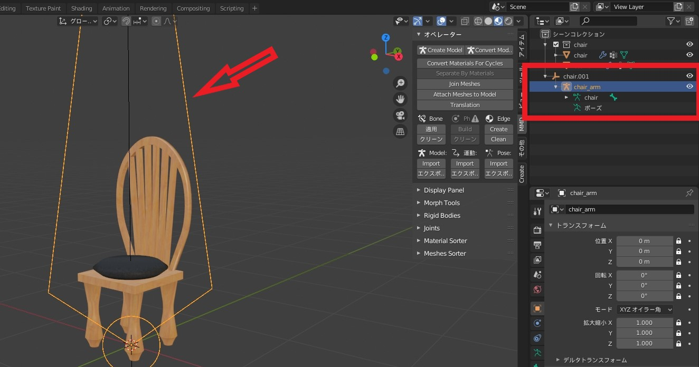

こんな感じの(xxx_arm)が生成されます.

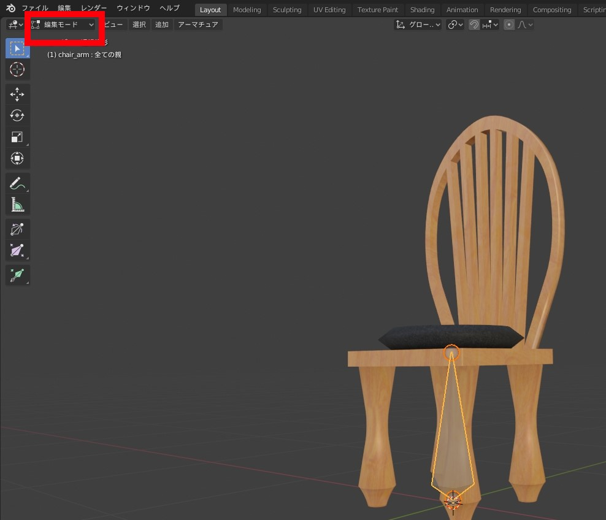
生成されたアーマチュアを選択して，編集モードからボーンをいい感じの大きさにしていい感じの位置にします．Aで全選択，Sでサイズ変更，G->Zで垂直方向に移動させるといい感じになると思います．

### ペアレント設定

#### オブジェクトとアーマチュアのペアレント

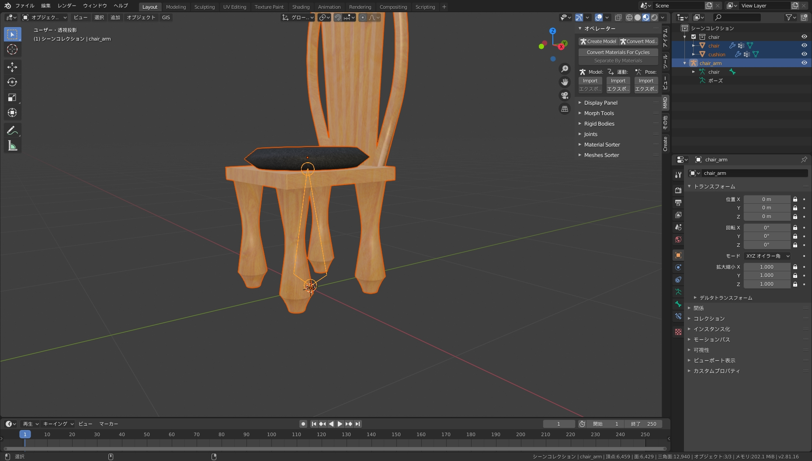

オブジェクトモードで，オブジェクトとボーンを選択して画像のような状態にします．Ctrlで順番に選択してボーンを最後に選択する方法でも良いですが，特に無駄なオブジェクトがなければ，ボーンを選択->Aが早いです．

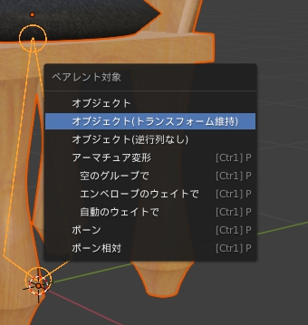

その状態でCtrl+Pを押してオブジェクト(トランスフォームを維持 )を選択します.

#### 頂点グループの設定

まず，メインとして追従させたいオブジェクトから設定していきます．この場合であれば，chairですし，もし部屋とかであれば床になるオブジェクトとかになると思います．

この設定の順序を間違えると椅子を動かしたのにクッションが追従せず，クッションを動かしたら椅子が動くみたいな感じになります．別々で動かす方法は詳しくは解説しませんが一通りやればなんとなく応用でできると思います．

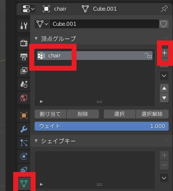

メインとなるオブジェクトを選択して，緑逆三角形のところから頂点グループを追加します．わかりやすい名前に変えておいてください．

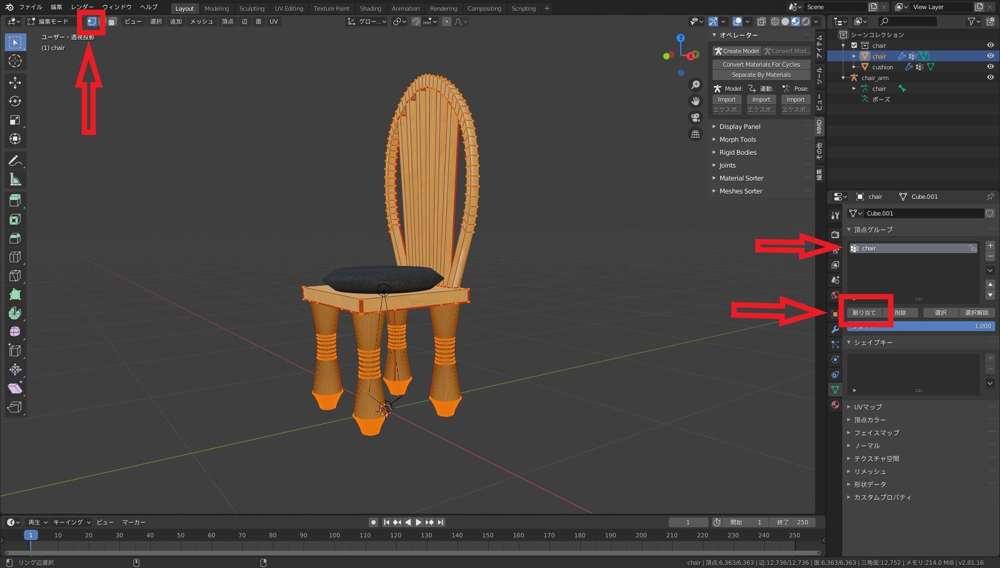

その後，編集モードから頂点選択モードにして，頂点を全選択，割当先の頂点グループがアクティブな状態で割り当てボタンで割り当ててください．

#### アーマチュア(モディファイアー)を追加

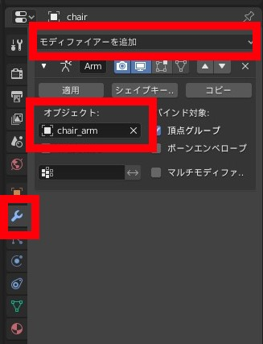
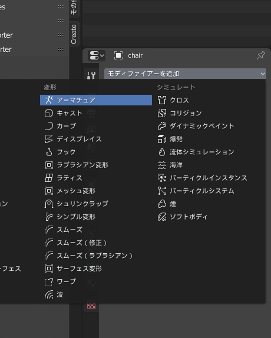

オブジェクトにアーマチュアというモディファイアーを追加します．追加できたらオブジェクトにxxx_armを適用します．

#### ボーン名の変更

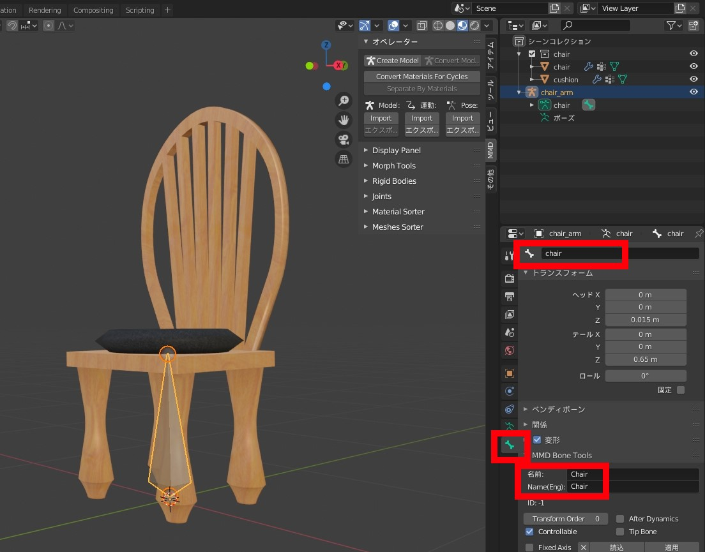

次にアーマチュアを選択して，編集モードでボーンを選択，上のボーン名を**頂点グループ**と同じ名前に設定します．MMD Bone Toolsの名前は適当に設定するか，しなくてもいいです．

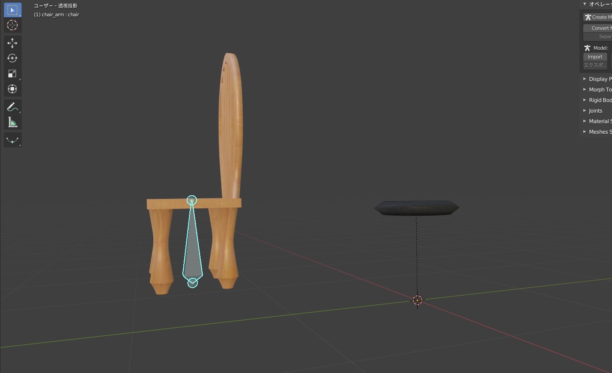

この設定を終えると，アーマチュアを選択してからポーズモードでオブジェクトが追従してくることが確認出来ます．

追従できてなかったらどこかミスってます．

#### 追従させるオブジェクトの追加

##### 同じボーンに追従させる場合

   追従させたいオブジェクトに同名の頂点グループを作成します．

##### 新たにボーンを追加する場合
   
   追従させたいオブジェクトに別の名前の頂点グループを作成します．

   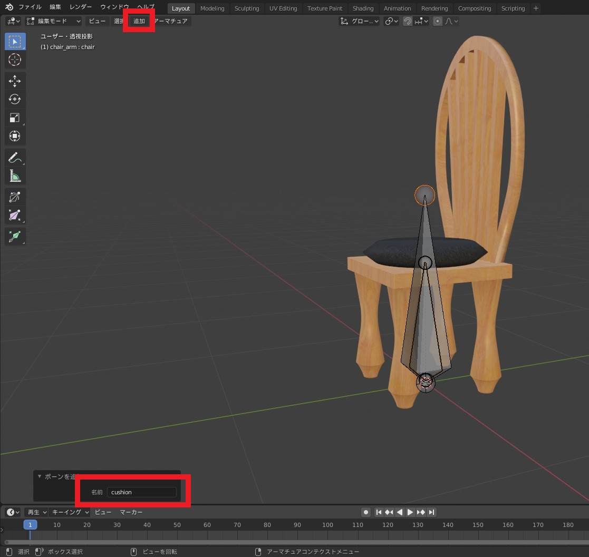

   アーマチュアの編集モードから新たにボーンを追加します．このタイミングでボーン名を設定しても良いです．

   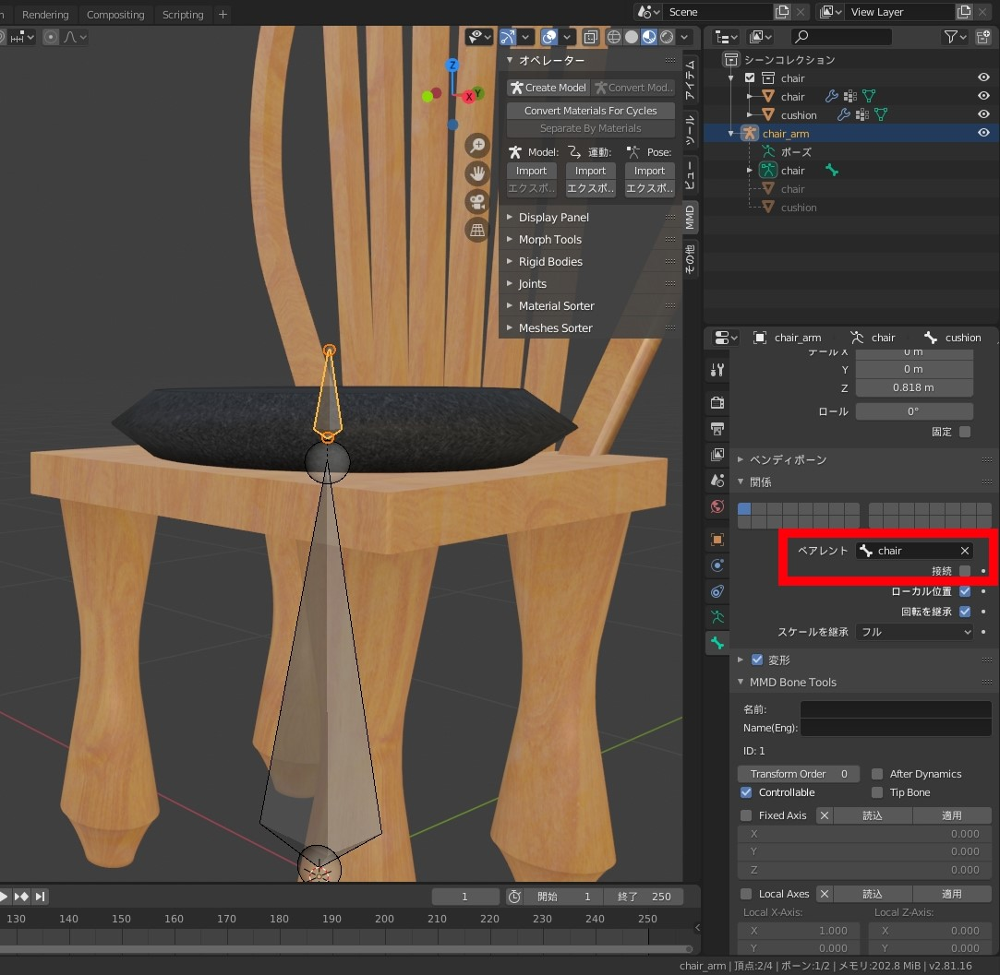

   今回もいい感じの大きさや位置にしたらボーン設定のペアレントでさっきのボーンを選択します．接続をONにすると従属するボーンの挙動が回転のみになります．ボーン名も設定します．新しく作成した頂点グループと同じ名前を付けます．

   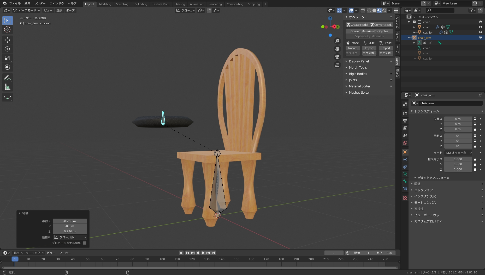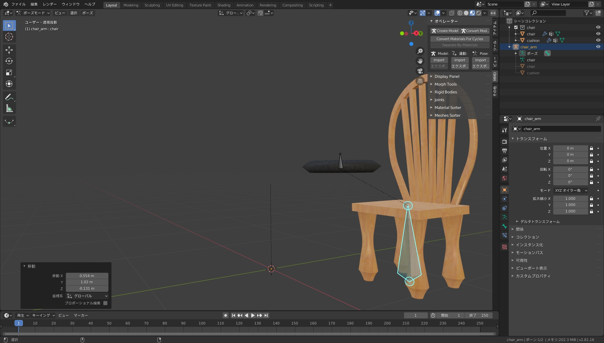

   そしたらこんな感じ

### テクスチャ等の設定

#### ノードの設定

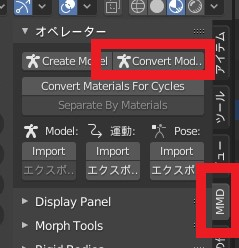

アーマチュアを選択して，MMDタブからコンバートします．

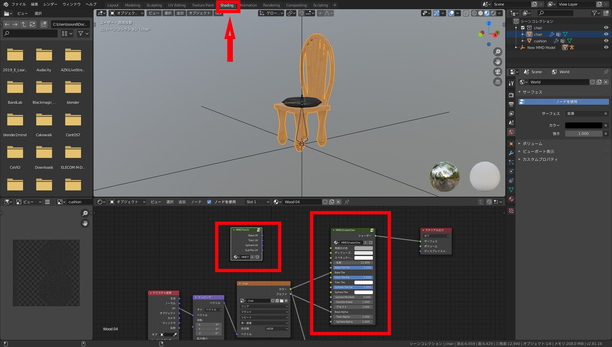

shadingタブに移動してノードを見るとなんか追加されてます．

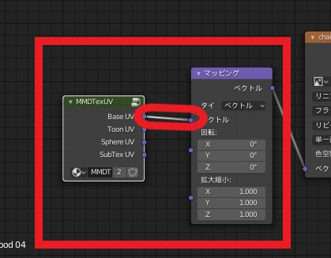

MMDTexUVをこんな感じにつなぎます．これを各マテリアルで行ってください．

#### テクスチャの出力

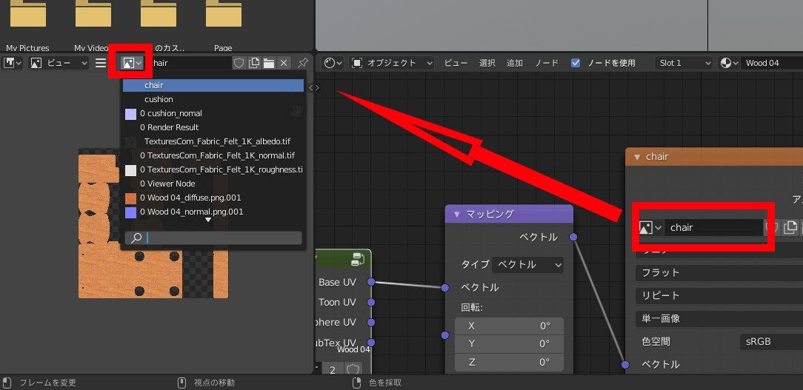

ノードの右側のテクスチャプレビューの所からマテリアルで使用しているテクスチャを選択します．

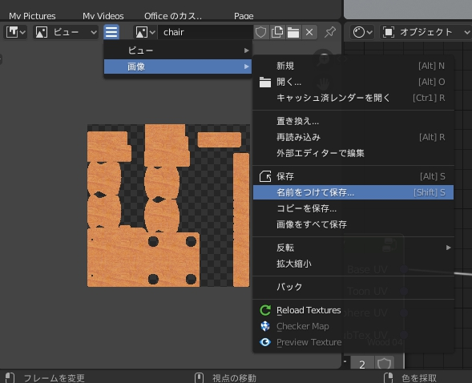

各マテリアルで使用しているものを保存してください．PMXで対応している形式じゃないと後でバグります．

#### ボーンの修正

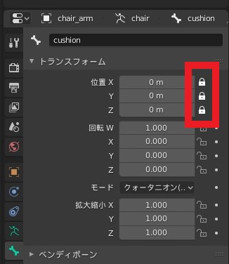

アーマチュア選択，ポーズモードで子ボーンの詳細を見ると位置がロックされてたりします．MMD上で個別に位置移動させたい場合はこれを解除してください．

### エクスポート

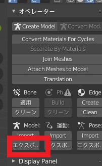

オブジェクトかアーマチュアを選択してModel: エクスポートでBlenderでの作業は完了です．出力の設定は多分いじらなくてよいです．

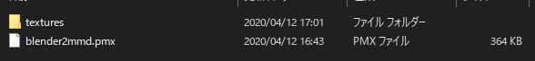

こんな感じの位置関係にしておいてください

## PMXEでの調整

MMDに読み込んでみてサイズやテクスチャがおかしかったらPMXEで調整します．

### サイズの調整

読み込むときに各自調整してください．だいたいx5かx10のことが多いです

### テクスチャの調整

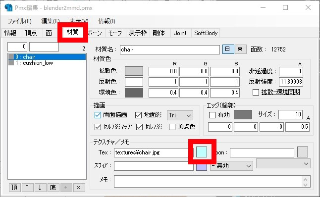

Pmx編集のウインドウから，材質タブのこの水色の所をクリックして画像を選択します．

ファイル>テクスチャ読み込みで読み込んだ後，変更で適用してください．

## 完成！！！！！

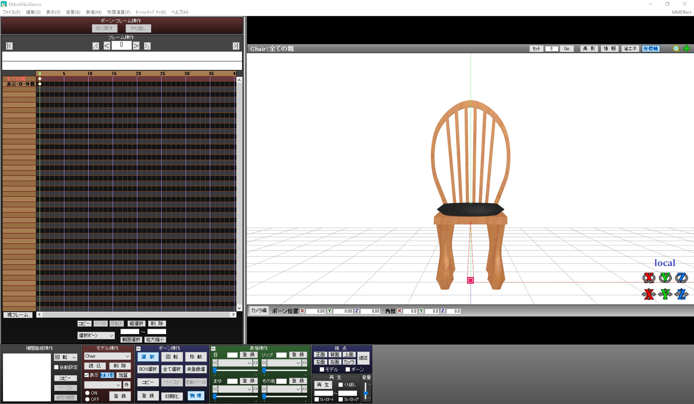

pmxファイルを移動するときはテクスチャフォルダも一緒に移動してください．

もし相対パスが変わるならPMXEで再設定してください．

[tips] .xファイルでエクスポートするとアクセサリとして使えます

Author Twitter: [@tkgtamagohan](https://twitter.com/tkgtamagohan "Author Twitter")